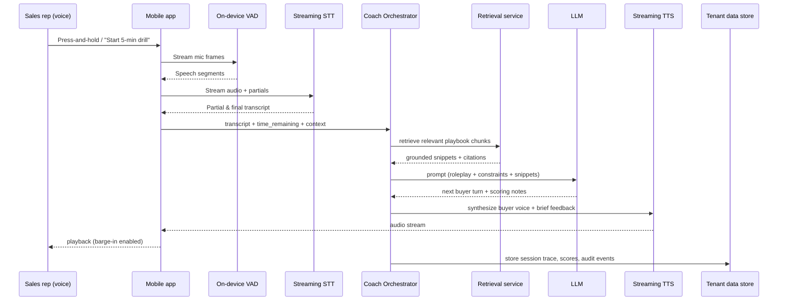
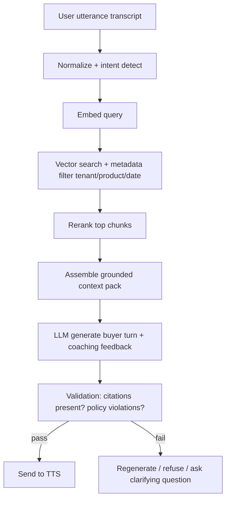
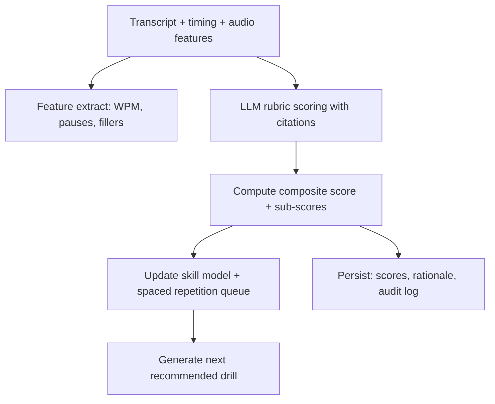

# Voice-first, time-boxed B2B coaching assistant for sales reps

## Executive summary

A voice-first, off-screen coaching assistant for sales reps is technically feasible today, but only if you treat it as a **real-time systems product** (latency, turn-taking, noisy audio, offline fallbacks) plus an **enterprise data product** (SSO, policy grounding, audit logs). The core value proposition is straightforward: reps have “dead time” while commuting or walking, and managers cannot coach everyone at the right cadence. Gartner has reported that effective sales manager coaching can unlock measurable performance improvement, which supports the business case for higher-frequency coaching workflows. citeturn20search0

The biggest early design constraint is platform reality: always-on hotword + background mic is hard to ship reliably on mobile due to OS restrictions and policy enforcement. On Android 14+, microphone foreground services cannot be started from the background except in specific exceptions, pushing you toward push-to-talk or explicit foreground sessions. citeturn7search1 On iOS, “background execution modes” exist (including audio), but you still need to architect within the platform’s constraints and user expectations around mic usage. citeturn7search0turn7search4

From a technical architecture standpoint, you should assume two modes:
- **Cloud “best quality” mode**: streaming STT + low-latency LLM + streaming TTS, with RAG grounded in the company playbook.
- **Low-connectivity mode**: reduced features (cached drill packs + on-device VAD + optional on-device ASR via Whisper.cpp), with delayed scoring sync. Whisper was trained at very large scale (680,000 hours) and is a strong baseline for robustness; whisper.cpp enables high-performance local inference with quantization and mobile-friendly acceleration paths. citeturn23view0turn14search0

A pragmatic MVP for the sales vertical is: **3–8 minute drills** that are strongly grounded in the org’s messaging and compliance rules, with **immediate voice feedback** and **manager-visible, auditable scores**. Learning science backs repeated short practice and feedback loops: deliberate practice emphasizes targeted effortful activities and feedback over time. citeturn23view4 Retrieval practice and spaced repetition give you a principled way to choose what to drill next. citeturn13search9turn13search2

Cost-wise, you can keep unit economics sane if you do modular STT + cheaper text models + efficient TTS. For example, Google Cloud Speech-to-Text standard recognition is $0.016/minute at low volumes, and Deepgram lists STT rates in the ~$0.0058–$0.0165/min range depending on model, with add-on diarization pricing. citeturn32view2turn33view1 An end-to-end speech-to-speech model can simplify latency and turn-taking, but it can be substantially more expensive; OpenAI’s Realtime API launch material gave an approximate $0.06/min audio input and $0.24/min audio output (model-dependent), which can dominate costs at scale. citeturn3search4

Assumptions used in this report (explicitly adjustable): playbooks exist as PDFs/Docs/Wikis; initial pilots are 50–500 reps; average usage is 5–10 minutes per rep per workday; regulated-industry constraints vary by tenant.

## Product scope and prioritized MVP for the sales vertical

A sales-rep coaching assistant should focus on **spoken behaviors that improve with repetition** and can be scored consistently, not on open-ended “advice.” The product boundary is: practice reps, not live customer calls, until you can handle consent, legal review, and call recording policies per jurisdiction.

### Sales-vertical scope that maps cleanly to drills
Discovery, objection handling, and pitch clarity are particularly drillable because they can be rehearsed as short, structured role plays with a rubric.

Recommended initial drill types:
- **Cold open + agenda** (30–60 seconds): crisp positioning statement, meeting goal, permission-based agenda.
- **Discovery ladder** (2–4 minutes): question sequencing, avoiding feature-dumping, summarizing back.
- **Objection micro-drills** (2–3 minutes): “We already have a vendor,” “No budget,” “Send a deck.”
- **Value prop compression** (60–90 seconds): explain product in one breath, then in 15 seconds.
- **Next-step close** (60–90 seconds): confirm impact, propose next meeting, set mutual action plan.

The business justification is higher-frequency coaching. Gartner’s public coaching research claims that effective coaching can unlock performance improvement, which is consistent with this product’s cadence thesis. citeturn20search0

### MVP feature set, prioritized
The MVP should prove: (a) reps use it in off-screen moments, (b) it improves measurable leading indicators, (c) managers trust the scoring.

High-priority MVP features:
1) **Time-boxed session launcher**: “I have 5 minutes” then pick drill category by voice.
2) **Scenario-based role play**: assistant plays buyer, rep responds; interruption (barge-in) supported.
3) **Immediate spoken feedback**: 2 strengths + 1 fix + 1 repeat line, then a redo prompt.
4) **Grounding to playbook**: coach must cite the relevant internal snippet in the post-session summary (visible in manager dashboard), using RAG. citeturn23view3
5) **Scorecard + history**: per-skill score over time, last 10 sessions, “next recommended drill.”
6) **Enterprise login + provisioning**: OIDC SSO + SCIM provisioning from day one for pilots. citeturn12search0turn12search1
7) **Audit-ready logs**: immutable session metadata and policy decisions to support SOC 2 expectations around controls and monitoring. citeturn5search0turn17search2

Deprioritize until after product-market pull:
- Full emotion labeling (risky, unreliable, and potentially sensitive).
- Full call recording ingestion (complex compliance and approvals).
- Fully autonomous agent actions (CRM writes) beyond read-only context fetch.

## Voice UX patterns and time-boxed user flows

Voice UX succeeds when it is **short**, **stateful**, and **repairable**. The most common failure mode is long, meandering audio responses the user cannot skim.

### Core voice UX patterns for “walking/commuting”
- **Explicit time contract**: user says time budget; system enforces it (“2 minutes left, one more objection”). This is a pacing algorithm input, not a UI decoration.
- **Turn-taking clarity**: short prompts plus explicit “your turn.” If you support barge-in, your audio stack must mix playback + capture reliably.
- **Repair**: when ASR confidence is low, ask a single disambiguation question, not “please repeat everything.”
- **Earcons and haptics**: subtle sounds for state (start listening, end, success) because the screen is often off.
- **One-shot summaries**: end with a compact recap and one next action, then stop.

OS constraints matter. Android’s restrictions around microphone foreground services push you toward foreground sessions and clear user control (push-to-talk, lock-screen control). citeturn7search1turn7search5

### Practice session sequence diagram (core flow)

This flow is compatible with either a modular STT/LLM/TTS stack or an integrated speech-to-speech model; the difference is where turn detection and streaming live. citeturn3search15turn15search3

## Required data inputs and secure ingestion and storage patterns

Your assistant becomes valuable when it is grounded in **the company’s truth**: product claims, positioning, competitive guidance, and regulated do-not-say rules. That grounding is also your safety layer.

### Data inputs you should assume you need
Minimum viable:
- **Sales playbooks** (messaging, objection handling, competitive battlecards).
- **Policy constraints** (approved claims, regulated disclaimers, forbidden topics).
- **Role history** (rep persona: SDR vs AE, vertical, tenure, onboarding stage).
- **Current task context** (upcoming meeting, account industry, stage, last notes).

These inputs drive both personalization and safety because you can explicitly disallow content that contradicts the playbook.

### Ingestion pattern that scales to enterprises
Use a two-lane ingestion model:
- **Lane A: raw document store** (immutable originals): store PDFs/Docs exports in object storage with versioning.
- **Lane B: retrieval index**: chunked text + embeddings + metadata filters (tenant, doc type, effective date, product line).

RAG’s core idea is combining parametric generation with retrieval from a non-parametric index, enabling updates and provenance. citeturn23view3

Security requirements for ingest:
- **Per-tenant isolation**: simplest is per-tenant encryption keys and strict metadata filters, plus database-level enforcement (row-level security).
- **Envelope encryption**: generate a data encryption key (DEK) for content, encrypt DEK with KMS key; both AWS KMS and Google Cloud KMS document envelope encryption as a standard pattern. citeturn16search4turn16search1
- **Tenant isolation in pooled Postgres**: Postgres row-level security is explicitly designed for per-row access policies; AWS prescriptive guidance recommends RLS to enforce tenant isolation in a pooled model. citeturn16search3turn16search22
- **Secrets and rotation**: use a secrets manager; Vault’s database secrets engine is a canonical dynamic-credential approach for reducing long-lived secrets. citeturn16search2turn16search15

### Auth and provisioning baseline
For enterprise pilots, do not invent auth. Use:
- **OIDC for SSO**: OpenID Connect is an identity layer on top of OAuth 2.0, built around claims. citeturn12search0
- **SCIM for provisioning**: SCIM 2.0 (RFC 7644) is the standard for cross-domain identity management in enterprise-to-cloud scenarios. citeturn12search1

## Real-time audio stack design

Real-time voice coaching is a pipeline problem: capture, segment, transcribe, decide, speak, all with stable latency.

### Wake word vs push-to-talk
A true wake word (“Hey Coach”) is attractive, but mobile constraints often make it the wrong MVP choice:
- On Android 14+, background mic capture is restricted; you typically need a foreground service type and valid user-facing justification. citeturn7search1
- On iOS, background execution modes exist, but continuous mic usage increases review and user trust risk. citeturn7search0turn7search4

Recommendation: MVP uses **push-to-talk** (press-and-hold on lock screen, headset button integration if available), then add wake word only after retention proves it’s worth the complexity.

If you do wake word later, on-device engines like Porcupine support custom wake words and ship as embedded models, which helps privacy and latency. citeturn7search2turn7search10

### Streaming STT, VAD, diarization, confidence
- **VAD**: run VAD on-device to reduce bandwidth and improve turn detection; WebRTC’s VAD implementation is widely used and available as a standalone library fork. citeturn0search6
- **Streaming STT**: you want partials and final transcripts. Google documents streaming recognition for microphone-like audio. citeturn15search3
- **Diarization**: for practice sessions, you often have one real speaker (rep) plus synthetic buyer. If you later ingest multi-speaker calls, diarization toolkits like pyannote.audio exist for speaker diarization pipelines. citeturn0search3
- **Confidence and uncertainty**: use a layered approach: ASR confidence + hesitation features (pauses, fillers) rather than “emotion labels.”

Filler words correlate with perceived fluency and confidence; research on filler word detection exists and can support automated signals. citeturn19search0turn19search16

### Emotion detection caution
Speech emotion recognition can be tempting for “adaptive empathy,” but published work highlights limited validation and bias risks. Treat it as an optional, user-consented feature that produces weak, non-diagnostic signals. citeturn11search4turn11search20

### Streaming TTS
For TTS, you want: high naturalness, low latency, and predictable pricing. AWS Polly (Neural voices) and Google Cloud TTS publish per-character pricing, and ElevenLabs publishes low-latency options with explicit latency claims for some tiers. citeturn2search2turn2search1turn2search3

### Candidate speech tech comparison

**Streaming STT providers (publicly listed pricing/features)**

| Provider | Streaming + partials | Public cost signal | Diarization | Privacy/deployment notes | Integration ease |
|---|---:|---:|---:|---|---|
| entity["company","Google Cloud","cloud platform"] Speech-to-Text | Yes citeturn15search3 | $0.016/min (standard) citeturn32view2 | Supported (varies by config) | Cloud service; enterprise governance depends on tenant settings | High if already on GCP |
| entity["company","Amazon Web Services","cloud provider"] Transcribe | Yes (streaming) citeturn1search2 | Starts at $0.024/min tiers citeturn1search2 | Options exist (feature-dependent) | Cloud service; pay attention to feature add-ons citeturn1search14 | High in AWS stack |
| entity["company","Deepgram","speech ai company"] STT | Yes (WebSocket) citeturn15search6 | ~$0.0058–$0.0165/min model-dependent citeturn33view1 | Add-on pricing published citeturn33view2 | Offers self-hosted options for enterprise citeturn33view0 | High (SDK + websockets) |
| entity["company","AssemblyAI","speech ai company"] STT | Yes; claims ~300ms P50 citeturn32view3 | $0.15/hr ($0.0025/min) citeturn32view3 | Feature pricing published citeturn32view3 | Hosted; evaluate enterprise contracts separately | High (simple API) |
| entity["company","Sensory","wake word sdk vendor"] (edge SDK) | N/A (wake/VAD focus) | SDK licensing | Wake + VAD models documented citeturn7search3turn7search7 | On-device benefits; enterprise procurement needed | Medium |

**Streaming / high-quality TTS providers (public pricing)**

| Provider | Streaming support | Public cost signal | Latency notes | Notes |
|---|---:|---:|---|---|
| entity["company","Amazon Polly","tts service"] | Yes | Neural voices priced per 1M chars citeturn2search2 | Provider-dependent | Solid enterprise default |
| entity["company","ElevenLabs","tts company"] | Yes | $0.06–$0.12 per 1K chars (tier/model) citeturn2search3 | Claims ~75ms for Flash/Turbo citeturn2search3 | Great voice quality; manage costs |
| Deepgram TTS | Yes (WebSocket) citeturn15search2 | $0.015–$0.030 per 1K chars citeturn33view2 | Built for voice agents | Convenient if also using their STT |
| Google Cloud TTS | Yes | Chirp 3 HD: $30 per 1M chars citeturn2search1 | Not always explicit | Strong model options |

## LLM orchestration, adaptive pacing, scoring, and drill generation

### RAG and prompt structure
RAG is non-negotiable for enterprise sales coaching because it enables:
- grounding to playbooks and policies,
- traceability (“why did the coach say that?”),
- fast updates without retraining. citeturn23view3

A production prompt layout that works:
- **System**: role, tone, time-box enforcement, forbidden content, compliance rules.
- **Context**: retrieved snippets with doc IDs, effective dates, and priority.
- **Conversation state**: drill type, rep skill level, remaining time, previous mistakes.
- **Few-shot**: 2–4 examples of “good rep response” vs “bad response” with scoring rationale.
- **Output schema**: force structured output for scoring and drill control.

OpenAI’s Structured Outputs is one example of enforcing JSON-schema compliance for tool calls and outputs, reducing brittle parsing. citeturn10search3turn10search7

### Safety and policy enforcement
Policy enforcement should be layered:
1) **Retrieval-time filtering**: only retrieve from approved doc sets.
2) **Generation-time constraints**: “only claim what is in cited snippets.”
3) **Post-generation validation**: detect missing citations for factual claims; block or regenerate.
4) **Provider-level moderation** where appropriate. citeturn18search8turn26view1

### Latency and cost tradeoffs
There are two viable architectures:
- **Modular**: STT (streaming) + text LLM + TTS (streaming). More control, easier compliance, cheaper when using small text models.
- **Integrated speech-to-speech**: fewer moving pieces and often better interruption handling. OpenAI’s Realtime API is explicitly designed for low-latency speech interactions. citeturn3search15turn3search4

OpenAI’s pricing page shows separate text-token and audio-token pricing for realtime/audio models, which is crucial for budget modeling. citeturn27view0turn27view3

### Adaptive pacing and difficulty
Treat time remaining as a first-class variable: your coach should behave differently at T–30 seconds than at T–5 minutes.

Mechanically:
- Maintain a per-skill proficiency estimate (objection handling, discovery, crispness).
- Choose the next “item” using a lightweight adaptive testing idea: pick prompts that best discriminate current skill and are likely to improve it (IRT and computer-adaptive testing are established frameworks for tailoring item difficulty). citeturn13search11turn13search3
- Use spaced repetition scheduling for recurring weaknesses; computational work exists on optimizing spaced repetition systems beyond heuristics. citeturn13search2turn13search14
- Use uncertainty signals (ASR confidence, long pauses, filler rates) to trigger hints or switch to a simpler objection. citeturn19search0turn19search16

This aligns with deliberate practice principles: repeated, feedback-driven improvement over time. citeturn23view4

### Scoring metrics and automated drill generation
Scorecards must be explainable to earn manager trust. A good rubric splits into:

Speech delivery (automatic):
- words per minute, pause ratio, filler count (prosody and pacing features are well-studied; even stress and WPM appear in acoustic feature taxonomies). citeturn19search2turn19search18
- disfluency detection can be automated; recent work targets efficient models. citeturn19search3

Sales technique (LLM-assisted but grounded):
- asked clarifying questions before pitching,
- mirrored buyer constraint,
- used approved value prop,
- handled objection without violating policy.

Content correctness (grounded):
- every factual claim about product, pricing, compliance must be traceable to retrieved snippets or explicit “unknown.”

Automated drill generation pipeline:
- From playbooks + CRM context, generate: buyer persona, objective, two likely objections, and “gold responses” that cite playbook text.
- Store drills as versioned artifacts tied to playbook version.

### RAG retrieval and scoring flowcharts

RAG’s motivation and structure are grounded in the original formulation of combining parametric and non-parametric memory for better factuality and inspectability. citeturn23view3

## Enterprise integrations, privacy, compliance, and auditability

### Integrations and sync patterns
You will be asked for these integrations in B2B:
- CRM: read-only context first, then optionally write-backs (next steps, coaching notes).
- LMS: push completion events and scores.
- HRIS: user attributes and org structure, mostly for reporting.
- SSO + provisioning: OIDC + SCIM.

For CRM auth, Salesforce’s REST API uses OAuth 2.0 via connected apps, which is the standard pattern enterprises expect. citeturn12search2turn12search14

Sync patterns that avoid pain:
- Prefer **webhooks** when available; otherwise incremental polling with cursors.
- Treat every write as **idempotent** with external IDs.
- Maintain a **tenant-owned data boundary**: cache only what you must for drill personalization, and record data lineage.

### Data privacy and “do not train” expectations
Enterprises increasingly demand contractual statements about training and retention:
- OpenAI states that business data is not used for training by default. citeturn18search12
- Amazon Bedrock explicitly states customer inputs/outputs are not used to train AWS or third-party models. citeturn18search3
- Google’s Gemini for Google Cloud documentation states prompts/responses are not used to train models, and Gemini Developer API documents “zero data retention” concepts for paid services. citeturn18search2turn18search6
- Anthropic documents retention for organization and API data, including a standard 30-day deletion window for API inputs/outputs (with exceptions). citeturn18search13

Even with provider commitments, you still need application-level controls: minimize what you send, encrypt what you store, and make retention configurable per tenant.

### SOC 2, GDPR-style principles, and logging
SOC 2 is an examination over controls relevant to security, availability, processing integrity, confidentiality, and privacy. citeturn5search0 Your product must support:
- access control,
- change management,
- incident response,
- monitoring and audit trails.

For privacy regulation alignment, follow GDPR-style principles: lawfulness, minimization, purpose limitation, storage limitation, integrity/confidentiality, and transparency. National DPAs like the Irish DPC describe these principles in accessible guidance. citeturn5search5

Auditability:
- Use cloud audit logs for infrastructure (Google Cloud Audit Logs is explicitly “who did what, where, when”). citeturn17search1
- Use standardized app observability: OpenTelemetry defines signals (traces, metrics, logs) and correlation primitives for distributed systems. citeturn17search2turn17search6

## Architecture, stack recommendations, cost estimates, and roadmap

### Scalable backend architecture
A clean decomposition:
- **Session gateway**: WebSocket/WebRTC termination, auth, rate limits.
- **Realtime orchestrator**: conversation state machine, time-box logic, tool calls.
- **Speech services**: STT/TTS adapters, fallback routing.
- **Retrieval service**: chunking, embedding, vector search, citations.
- **Scoring service**: rubric scoring + skill model updates.
- **Data plane**: Postgres for relational + object storage for raw docs + vector store.
- **Analytics**: event stream for product metrics and enterprise reporting.

### Recommended tech stack (prioritized choices)
Mobile:
- Start with native iOS/Android or a cross-platform framework only if you can ship low-latency audio reliably. The hard part is audio session management, not UI.

Audio + realtime transport:
- For DIY streaming: WebSocket audio frames (simplest) for MVP.
- For best-in-class realtime: WebRTC-based stacks and agent frameworks exist; LiveKit Agents explicitly supports both STT-LLM-TTS pipelines and realtime models. citeturn8search0turn8search4
- Daily cites very low first-hop latency and is built on WebRTC, but evaluate enterprise constraints per customer. citeturn8search14turn8search18

LLM + orchestration:
- Keep orchestration mostly in your codebase early; frameworks help but can hide latency and cost traps.
- If you use a framework, pick one that supports streaming and clean composition:
  - LangChain runnables/LCEL support sync/async/batch/streaming. citeturn10search0
  - LlamaIndex query engines formalize retriever + synthesizer pipelines. citeturn10search1
  - Semantic Kernel plugins and orchestration exist, but agent orchestration features may be experimental depending on version. citeturn10search2turn10search10

Vector store:
- MVP: Postgres + pgvector for simplicity; pgvector supports exact search and approximate indexes like HNSW/IVFFlat. citeturn9search2turn9search19
- Scale-out options: managed vector DBs (Pinecone, Weaviate, Qdrant) if operations or performance demand it. citeturn9search0turn9search1turn9search3

Security primitives:
- KMS envelope encryption (AWS KMS / Cloud KMS) citeturn16search4turn16search1
- Postgres RLS for tenant isolation citeturn16search3turn16search22
- OIDC + SCIM citeturn12search0turn12search1

### LLM provider comparison (public pricing + data-use signals)
| Provider | Text token pricing signal | Audio token pricing signal | Data usage stance (public docs) | Integration notes |
|---|---:|---:|---|---|
| OpenAI | gpt-4o, gpt-4o-mini, gpt-5 pricing published citeturn27view0turn27view1 | realtime/audio pricing published citeturn27view3turn3search4 | “No training by default” for business data citeturn18search12 | Strong structured output + realtime tooling citeturn10search3turn3search15 |
| entity["company","Anthropic","ai lab"] | Opus/Sonnet pricing published citeturn26view2turn4search4 | Depends on integration path | API org retention described citeturn18search13 | Strong for text reasoning; pair with separate speech |
| entity["company","Google","tech company"] Gemini API | Gemini 2.5 pricing published citeturn26view3 | Audio token pricing shown for some models citeturn26view3 | No training on prompts/responses (docs) citeturn18search2turn18search6 | Good if you want Search grounding hooks citeturn26view3 |
| Bedrock | Model-dependent pricing citeturn4search2 | Model-dependent | No training on customer I/O citeturn18search3turn18search15 | Enterprise procurement friendly |

### Offline and low-connectivity strategy
You need graceful degradation:
- Cache “drill packs” (scenario + rubric + approved snippets) on device.
- Run VAD on device and buffer audio until connectivity is back.
- Optional on-device ASR using whisper.cpp; it is explicitly designed for high-performance local inference with quantization and hardware acceleration paths. citeturn14search0
- Keep on-device LLM optional; llama.cpp exists for local inference, but mobile latency/thermals make it a tradeoff rather than a default. citeturn14search3
- If you use Apple’s Speech framework, availability can vary by locale and may require internet for some languages. citeturn14search5

### Rough cost estimates (illustrative)
Scenario: 200 reps, 10 minutes/day, 20 workdays/month (40,000 minutes of rep audio). Using modular STT + small text LLM + standard TTS can keep costs under control:
- STT at ~$0.016/minute (Google) → ~$640/month. citeturn32view2
- TTS using AWS Polly Neural per-character pricing often lands far below STT at this usage level (exact depends on speaking rate). citeturn2search2
- Text LLM cost can be small if you use a mini model and keep retrieved context tight; OpenAI publishes low-cost “mini” pricing tiers (model-dependent). citeturn27view0

If instead you use an integrated speech-to-speech pricing model at ~$0.06/min input and ~$0.24/min output, costs can rise materially (output minutes matter). citeturn3search4

### Development roadmap, team roles, YC-style milestones

Roles (lean but realistic):
- Mobile engineer (audio session + background/lock screen control).
- Backend engineer (realtime orchestration + multi-tenant data).
- ML/infra engineer (RAG, eval harness, speech pipeline tuning).
- Founding PM/GT-M (customer discovery, security questionnaires, pilots).

Milestones that investors care about:
- **Week 4–6**: prototype that works hands-free enough to use on a walk, with one playbook ingested and reliable end-to-end latency.
- **Month 2–3**: pilot with 2–5 companies, 50–200 seats total, with weekly active usage and measurable lift in leading indicators (practice minutes, rubric score improvement, manager adoption).
- **Month 4–6**: enterprise hardening: SSO + SCIM everywhere, audit logs, configurable retention, and a credible SOC 2 readiness path. citeturn12search0turn12search1turn5search0

### Next-step implementation checklist
- Define first two drill rubrics and “gold responses” from a single playbook.
- Implement push-to-talk session + streaming STT + streaming TTS.
- Build RAG ingestion (chunking + metadata + embeddings) and require citations in summaries. citeturn23view3turn26view1
- Add structured JSON outputs for scoring and drill control. citeturn10search3
- Implement tenant isolation: RLS + per-tenant keys + audit logs. citeturn16search22turn16search4turn17search1
- Add OIDC login + SCIM provisioning for pilots. citeturn12search0turn12search1
- Stand up an evaluation harness: replay transcripts, check rubric stability, measure latency and cost per minute.

### Minimal viable prototype plan (deliverables and timeline)
**Sprint 1 (2 weeks)**  
Deliverables: mobile app that records audio, runs on-device VAD, streams audio to STT, plays back TTS responses; basic 3-minute drill loop; latency dashboard (p50/p95). citeturn0search6turn15search3turn2search2

**Sprint 2 (2 weeks)**  
Deliverables: RAG over one playbook; citations in end summary; structured scoring output; session storage with tenant keying; basic admin UI to upload playbook files. citeturn23view3turn10search3turn16search4

**Sprint 3 (2 weeks)**  
Deliverables: OIDC SSO integration + SCIM stub; manager dashboard with score trend; offline drill-pack caching; scripted pilot onboarding checklist. citeturn12search0turn12search1turn13search2

At the end of 6 weeks, you should be able to run a real pilot and answer the only question that matters: do reps voluntarily use it during commutes, and do their scores improve in ways managers recognize as meaningful.