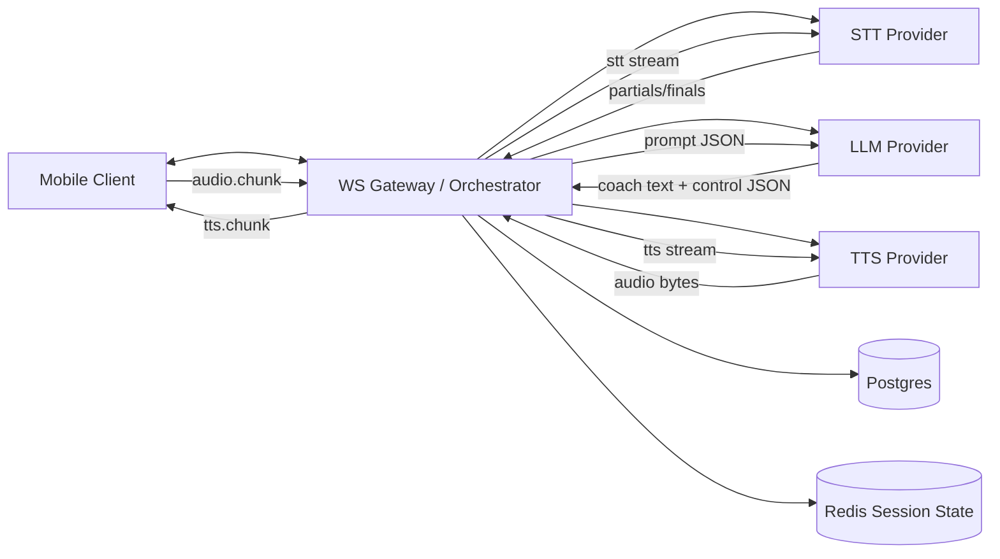
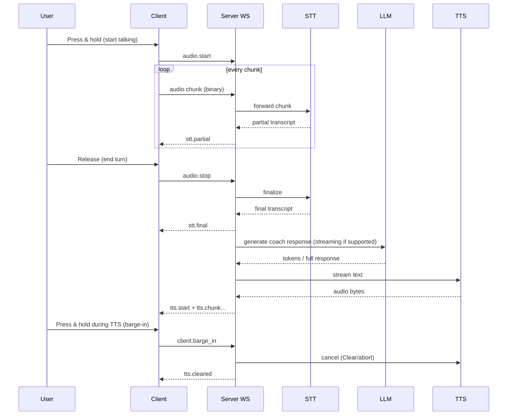

# Phase 1 Claude Code Superprompt for a B2C Voice-Native Time-Boxed Coaching App

## Executive summary

Phase 1 is a real-time systems build. If its audio pipeline feels laggy or interrupts fail, users will bounce even if the coaching is “smart.” Your safest Phase 1 wedge is a **push-to-talk, foreground-only coaching session** with **streaming STT**, **streaming TTS**, a **single 3-minute drill**, **hard timer enforcement**, and **barge-in**. This is aligned with common mobile platform constraints around always-on mic usage and background execution, which strongly favors push-to-talk for an MVP. citeturn2search0turn2search4turn2search8 fileciteturn0file0

For low-latency Phase 1, a modular pipeline is the most controllable: streaming STT over WebSocket (for partial transcripts), LLM for the next coach turn, and streaming TTS. For example, entity["company","Deepgram","speech apis"] provides both streaming STT (`wss://api.deepgram.com/v1/listen`) and streaming TTS (`wss://api.deepgram.com/v1/speak`) with control messages like `Clear` that directly support interruption behavior. citeturn5view0turn6view0turn15view0 entity["company","ElevenLabs","voice ai platform"] supports real-time TTS streaming via HTTP chunked transfer encoding and explicitly documents latency optimization strategies (Flash models + streaming). citeturn7view0turn12search3

Phase 1 should **not** ship enterprise features (SSO/SCIM, multi-tenant policy RAG), and it should avoid anything that could be interpreted as biometric voiceprint storage. Keep raw audio retention off by default and store only minimal transcripts/events needed for debugging. This reduces legal and trust risk while you validate B2C retention. fileciteturn0file1

The rest of this report provides: exact Phase 1 scope + acceptance criteria, provider decision tables, a detailed WebSocket event protocol, streaming STT/TTS patterns (with barge-in), session plan JSON schemas, time control loop pseudocode + latency targets, minimal backend + Postgres schema snippets, client requirements (React Native vs native iOS tradeoffs), strict JSON LLM prompt templates, QA tests + monitoring, and an exact copy-paste “Claude Code superprompt.”

## Phase 1 scope and acceptance criteria

Phase 1 is intentionally narrow: one drill, one timer, one interaction loop. Everything else is scaffolding.

### Phase 1 scope

**In scope**
- Push-to-talk mobile session UI (foreground session only).
- Single 3-minute drill loop:
  - Coach speaks (TTS), user responds (mic), coach interrupts if needed, coach closes.
- Streaming STT with partial and final transcripts.
- Streaming TTS audio playback with barge-in.
- Hard timer enforcement on the server (authoritative).
- Simple “session plan” generated before the drill begins (static template or LLM-generated, but must be structured JSON).
- Minimal persistence: session metadata, transcripts, timing events, and error logs.

**Out of scope**
- File upload and RAG grounding.
- Multiple drill types / marketplace.
- User accounts beyond anonymous device ID (optional email can be deferred).
- Always-on hotword, background mic capture, lock-screen deep integration.
- Real scoring dashboard, spaced repetition queues, and enterprise integrations.

This scope matches the “Sprint 1” style MVP described in your original technical stack doc: push-to-talk + streaming STT/TTS + short drill loop + latency measurement as a first-class deliverable. fileciteturn0file0

### Acceptance criteria

These are concrete “ship/no-ship” checks.

**Timer enforcement**
- Server starts an authoritative 180-second timer at `session.start_ack`.
- Client receives `timer.tick` at 1 Hz.
- At `t=0`, server sends `timer.expired` and forces:
  - STT finalize
  - TTS stop
  - session close sequence (one closing line max, or an earcon + “Session ended”)
- Client cannot extend time without an explicit `session.extend_time` event (even if you do not expose this in UI yet).

**Streaming STT**
- Partial transcripts appear while the user is speaking (if provider supports interim). Example: Deepgram `interim_results=true` produces interim updates. citeturn5view0turn11search1
- Final transcript is emitted when end-of-turn is detected (provider endpointing or explicit client stop).

**Streaming TTS**
- Audio playback begins before the full coach message completes (true streaming).
- If using Deepgram streaming TTS, server can send incremental text via `Speak` and flush with `Flush`. citeturn6view0turn6view1
- If using ElevenLabs, backend streams raw audio bytes over HTTP chunked transfer encoding to the client. citeturn7view0turn4view3

**Barge-in**
- If user presses and holds push-to-talk while coach audio is playing, client sends `client.barge_in` immediately and stops local playback.
- Server cancels current TTS generation:
  - Deepgram: send `{ "type":"Clear" }` to stop audio output as soon as possible. citeturn15view0turn6view0
  - ElevenLabs: abort the HTTP stream at the backend (implementation detail, but required behavior).
- “Barge-in to silence” must complete fast enough to feel instant (target below under latency).

**Reliability**
- If STT or TTS provider errors, the session ends gracefully with an error toast and closes sockets cleanly (RFC 6455 closing handshake semantics). citeturn1search3

## Required inputs and provider options

### Required inputs and assets

These are the non-negotiables Claude Code must request or stub.

**API keys**
- STT provider key (Deepgram / AWS / Google / AssemblyAI).
  - Deepgram authenticates via `Authorization` header, or a temporary token passed via query parameter. citeturn5view0
  - AWS Transcribe WebSocket uses SigV4 signing, not a simple bearer token. citeturn4view4
- TTS provider key (Deepgram / ElevenLabs / AWS Polly / Google / Azure).
  - ElevenLabs examples use an API key in `.env` (`ELEVENLABS_API_KEY`). citeturn7view1
- LLM provider key.
  - entity["company","OpenAI","api platform"]: Structured Outputs enforces JSON Schema adherence; streaming responses via SSE. citeturn10view0turn10view1
  - Gemini API uses `x-goog-api-key` header for auth and supports standard + streaming (SSE) + real-time (WebSocket Live API). citeturn8view1turn9view0

**App assets**
- Minimal earcons (start listening, stop listening, timer warning, session end).
- One prebuilt drill prompt template and one session plan template.
- App privacy copy: “Not for use while driving,” plus “No voiceprint storage” posture (Phase 1). fileciteturn0file1

### Provider comparison tables

The tables below focus on Phase 1 needs: streaming, partials, cancellation, and integration complexity. Defaults are recommendations, not assumptions.

#### Streaming STT options

| Provider | Streaming transport | Partials / interim | Auth complexity | Low-latency notes | Phase 1 fit |
|---|---|---:|---|---|---|
| Deepgram | WebSocket `wss://api.deepgram.com/v1/listen` citeturn5view0 | `interim_results=true` citeturn5view0turn11search1 | Simple bearer | Built for live streaming; supports endpointing, utterance end events citeturn5view0turn15view4 | Best default for MVP speed |
| AssemblyAI | WebSocket streaming API citeturn11search3turn11search9 | Partial + final | Simple bearer | Marketing claims “few hundred ms” and “~300ms P50” (verify in your environment) citeturn11search6 | Good alternative |
| AWS Transcribe | WebSockets supported for streaming citeturn4view4turn1search9 | Yes | SigV4 required citeturn4view4 | Production-grade, but signing adds build complexity | Better when you already live on AWS |
| Google Cloud STT | Streaming via **gRPC only** citeturn12search0turn1search12 | Yes | Service account / ADC | Great quality; more infra and gRPC client complexity on mobile-backend pipelines | Usually not Phase 1 fastest |

#### Streaming TTS options

| Provider | Streaming transport | Interrupt story | Latency tooling | Phase 1 fit |
|---|---|---|---|---|
| Deepgram Aura | WebSocket `wss://api.deepgram.com/v1/speak` with `Speak`, `Flush`, `Clear` citeturn6view0turn15view0 | `Clear` explicitly stops output quickly citeturn15view0 | Docs emphasize immediate playback on first chunk citeturn6view1 | Best if you want true streaming + easy barge-in |
| ElevenLabs | HTTP streaming (chunked transfer encoding) citeturn7view0turn4view3 | Abortable HTTP stream (implementation), not a TTS “Clear” control | Latency guide: Flash models + streaming citeturn12search3 | Great voice quality; slightly more cancellation engineering |
| Amazon Polly | Returns an audio stream from `SynthesizeSpeech` citeturn1search6turn1search2 | Cancellation is request-level, not conversational-level | Stable enterprise default | Fine for Phase 1 but less “voice agent” oriented |
| Google Cloud TTS | Supports bidirectional streaming (preview) citeturn12search12 | Depends on client | Streaming can reduce latency by sending text while receiving audio citeturn12search12 | Viable, but preview caveats |
| Azure Speech TTS | REST + Speech SDK; Speech SDK supports real-time scenarios and streams citeturn12search2turn12search10 | Depends on SDK behavior | Has latency best practices and metrics vocabulary (first byte latency) citeturn12search17 | Viable if you are Azure-first |

#### LLM options for strict JSON + speed

| Provider | Streaming | Strict JSON Schema support | Real-time audio options | Phase 1 fit |
|---|---|---|---|---|
| OpenAI | SSE streaming responses citeturn10view1 | Structured Outputs enforces schema adherence citeturn10view0 | Realtime API offers WebSocket/WebRTC speech-to-speech (optional path) citeturn4view5turn3search8 | Best for “strict JSON or fail” |
| Gemini | SSE streaming (`streamGenerateContent`) and WebSocket Live API citeturn8view1 | Structured outputs via JSON schema (`response_json_schema`) citeturn9view0 | Live API is WebSocket-based (bidi) citeturn8view1 | Strong alternate, especially if you want Live later |
| Anthropic | SSE streaming messages (`stream:true`) citeturn10view2 | No first-class “schema enforced” guarantee in the cited docs | No native audio channel in core Messages (you orchestrate speech separately) | Great text quality, but validate JSON yourself |

### Recommended defaults for Phase 1 (not a final selection)

If you want the lowest engineering risk for Phase 1 barge-in plus streaming-to-first-audio:
- **STT:** Deepgram WebSocket live transcription. citeturn5view0turn11search26  
- **TTS:** Deepgram streaming TTS WebSocket for `Clear`-based interruption. citeturn6view0turn15view0  
- **LLM:** OpenAI with Structured Outputs for plan + pacing JSON. citeturn10view0  

If you want highest perceived TTS quality for consumers:
- Keep STT on Deepgram, use ElevenLabs streaming TTS and invest a bit more in cancellation + buffering. citeturn7view0turn12search3

## Real-time WebSocket protocol design

This section defines the exact protocol between mobile client and your backend gateway. It is independent of provider choice.

### Design goals

- Full-duplex: audio up, transcripts + audio down.
- Server-authoritative timer.
- Explicit state machine and idempotent events.
- Safe reconnection: resume if possible, otherwise fail fast with a clean UX.
- Clean shutdown aligned with WebSocket close handshake behavior. citeturn1search3

### Event envelope

Every JSON event (client or server) uses this envelope:

```json
{
  "type": "string",
  "event_id": "uuid",
  "session_id": "uuid",
  "ts_ms": 0,
  "payload": {}
}
```

Binary frames are reserved for `audio.chunk` only.

### Core event types

#### Client → Server events

- `client.hello` (JSON): protocol version, app version, device info.
- `auth.anonymous` (JSON): anonymous user token or a signed device token.
- `session.start` (JSON): requested duration, drill type, optional user goal text.
- `audio.start` (JSON): codec, sample rate, chunking settings.
- `audio.chunk` (BINARY): raw PCM frames for STT.
- `audio.stop` (JSON): indicates end of user turn (push-to-talk released).
- `client.barge_in` (JSON): user started speaking while TTS playing, cancel TTS.
- `session.extend_time` (JSON): optional, not required in Phase 1 UI.
- `client.ping` (JSON): app-level heartbeat.
- `client.resume` (JSON): reconnection attempt with resume token.

#### Server → Client events

- `server.hello` (JSON): accepted protocol version, assigned connection_id.
- `auth.ok` / `auth.error` (JSON).
- `session.start_ack` (JSON): session_id, authoritative duration, start_ts.
- `session.plan` (JSON): the structured session plan.
- `timer.tick` (JSON): remaining_ms, segment_name.
- `timer.warning` (JSON): remaining_ms, recommended_action.
- `timer.expired` (JSON): forced close.
- `stt.partial` (JSON): partial transcript + stability/confidence if available.
- `stt.final` (JSON): final transcript for the last user turn.
- `coach.text` (JSON): coach text (for debugging/UI caption).
- `tts.start` / `tts.chunk` (BINARY) / `tts.end` (JSON).
- `tts.cleared` (JSON): confirms server canceled speech.
- `server.error` (JSON): typed errors with retry semantics.
- `server.goodbye` (JSON): closing reason, close_code.

### Payload schemas

Below are minimal JSON Schemas Claude should implement in `/packages/shared/schemas`.

#### `session.start` payload schema

```json
{
  "type": "object",
  "properties": {
    "requested_duration_ms": { "type": "integer", "minimum": 30000, "maximum": 1800000 },
    "drill_id": { "type": "string" },
    "user_goal": { "type": "string", "maxLength": 280 }
  },
  "required": ["requested_duration_ms", "drill_id"]
}
```

#### `audio.start` payload schema

Use PCM as the Phase 1 default.

```json
{
  "type": "object",
  "properties": {
    "codec": { "type": "string", "enum": ["pcm_s16le"] },
    "sample_rate_hz": { "type": "integer", "enum": [16000, 24000, 48000] },
    "channels": { "type": "integer", "enum": [1] },
    "chunk_ms": { "type": "integer", "enum": [20, 40, 60] }
  },
  "required": ["codec", "sample_rate_hz", "channels", "chunk_ms"]
}
```

### Error handling and close codes

**Typed errors** (server.error)
- `ERR_UNAUTHORIZED` (no auth)
- `ERR_BAD_EVENT_SCHEMA` (JSON schema validation fail)
- `ERR_UNSUPPORTED_AUDIO_FORMAT`
- `ERR_PROVIDER_STT_UNAVAILABLE`
- `ERR_PROVIDER_TTS_UNAVAILABLE`
- `ERR_LLM_UNAVAILABLE`
- `ERR_SESSION_STATE` (illegal event ordering)
- `ERR_RATE_LIMIT`

**Close behavior**
- Use normal closure for clean finishes.
- Use policy violation or internal error where appropriate (your app can map these to UX). RFC 6455 defines the close handshake and close codes as part of WebSocket protocol behavior. citeturn1search3

### Reconnection strategy

You do not want “ghost sessions” in voice apps.

**Server state**
- Store session runtime state in Redis keyed by `session_id` with TTL (15 minutes).
- Store `last_client_audio_seq` and `last_server_tts_seq`.

**Client resume**
- On disconnect, client attempts reconnect with exponential backoff (0.2s, 0.5s, 1s, 2s, 5s).
- Client sends `client.resume` with:
  - `session_id`
  - `resume_token`
  - `last_server_event_id_seen`
- Server replies:
  - `server.resume_ok` (continue timer) OR
  - `server.resume_failed` (end session, return partial transcript)

**Timer policy**
- Phase 1 simplest: timer continues while disconnected, because server is authoritative. If disconnect > 5 seconds, end the session and tell the user. (You can revisit later.)

### Mermaid diagrams

#### Event flow overview



#### Sequence for one push-to-talk turn with barge-in



## Streaming STT/TTS patterns and barge-in handling

This section is the practical wiring guidance Claude Code needs, with provider-backed details.

### Streaming STT with Deepgram (WebSocket)

Deepgram’s live STT WebSocket endpoint is `wss://api.deepgram.com/v1/listen`. It supports binary audio frames (`ListenV1Media`) plus control messages like `Finalize` and `KeepAlive`. citeturn5view0turn4view0

Key parameters you will actually use in Phase 1:
- `interim_results=true` for partials. citeturn5view0turn11search1
- `endpointing=` milliseconds to force finalization during pauses (VAD-based). citeturn15view3turn15view4
- `utterance_end_ms=` to receive `UtteranceEnd` messages for robust pause detection even in noisy environments. citeturn15view4turn5view0

**Deepgram STT end-of-turn logic**
- Prefer `speech_final=true` returns (from endpointing) for “final.” citeturn15view3turn15view4
- If you get `UtteranceEnd` without `speech_final`, treat it as a turn boundary and finalize your downstream logic anyway. citeturn15view4

**Node.js example: Deepgram STT adapter (skeleton)**  
(Example uses `ws` package; Claude Code should implement full error handling + metrics.)

```js
import WebSocket from "ws";

export function connectDeepgramSTT({ apiKey, model, sampleRateHz }) {
  const url = new URL("wss://api.deepgram.com/v1/listen");
  url.searchParams.set("model", model);
  url.searchParams.set("interim_results", "true");
  url.searchParams.set("encoding", "linear16");
  url.searchParams.set("sample_rate", String(sampleRateHz));
  url.searchParams.set("endpointing", "500");        // tune later
  url.searchParams.set("utterance_end_ms", "1000");  // optional but useful

  const ws = new WebSocket(url.toString(), {
    headers: { Authorization: `Token ${apiKey}` },
  });

  return ws;
}
```

### Streaming TTS with Deepgram (WebSocket) and barge-in

Deepgram streaming TTS uses `wss://api.deepgram.com/v1/speak`, accepts control messages:
- `{ "type":"Speak", "text":"..." }`
- `{ "type":"Flush" }`
- `{ "type":"Clear" }` (interrupt)
- `{ "type":"Close" }` citeturn6view0turn6view0

For barge-in, Deepgram explicitly documents `Clear` as a way to stop sending audio “as soon as possible” and clear internal buffers, returning a `Cleared` confirmation. citeturn15view0turn6view0

**Node.js example: Deepgram TTS adapter with Clear**

```js
import WebSocket from "ws";

export function connectDeepgramTTS({ apiKey, model = "aura-asteria-en" }) {
  const url = new URL("wss://api.deepgram.com/v1/speak");
  url.searchParams.set("model", model);
  url.searchParams.set("encoding", "linear16");
  url.searchParams.set("sample_rate", "24000");

  const ws = new WebSocket(url.toString(), {
    headers: { Authorization: `Token ${apiKey}` },
  });

  function speak(text) {
    ws.send(JSON.stringify({ type: "Speak", text }));
  }
  function flush() {
    ws.send(JSON.stringify({ type: "Flush" }));
  }
  function clear() {
    ws.send(JSON.stringify({ type: "Clear" }));
  }
  function close() {
    ws.send(JSON.stringify({ type: "Close" }));
  }

  return { ws, speak, flush, clear, close };
}
```

**Text chunking (required for low latency)**  
Deepgram recommends collecting tokens until you have complete sentences when streaming LLM output into a TTS WebSocket, rather than dribbling individual tokens. citeturn15view2turn15view1

### Streaming TTS with ElevenLabs (HTTP chunked)

ElevenLabs supports streaming audio by returning raw audio bytes over HTTP using chunked transfer encoding. citeturn7view0turn14search2

To reduce latency, ElevenLabs documents:
- Use Flash models.
- Leverage streaming.
- Consider proximity.
- Choose appropriate voices. citeturn12search3

**Node/TS example: stream ElevenLabs audio and forward to client**  
(Claude Code should implement full auth headers and correct client library usage based on latest SDK.)

```ts
import { ElevenLabsClient } from "@elevenlabs/elevenlabs-js";

export async function* streamElevenLabsTTS({
  apiKey,
  voiceId,
  text,
  modelId,
}: {
  apiKey: string;
  voiceId: string;
  text: string;
  modelId: string;
}) {
  const client = new ElevenLabsClient({ apiKey });
  const audioStream = await client.textToSpeech.stream(voiceId, {
    text,
    modelId,
  });

  for await (const chunk of audioStream) {
    yield chunk; // bytes
  }
}
```

**Barge-in with HTTP streaming**
- Store an AbortController per TTS request.
- On `client.barge_in`, abort the in-flight stream and stop sending `tts.chunk`.
- Send `tts.cleared` to confirm.

### Session initialization flow and the Phase 1 session plan schema

Even with one drill, you still need a structured plan so your pacing logic has something to enforce.

**Flow**
1. Client sends `session.start` with `requested_duration_ms=180000` and `drill_id="pitch_3min_v1"`.
2. Server returns `session.start_ack`.
3. Server generates a session plan (static template or LLM).
4. Server sends `session.plan`.
5. Server starts timer ticks.
6. Server speaks the first coach prompt.

**Session plan JSON schema (Phase 1)**

```json
{
  "type": "object",
  "properties": {
    "plan_version": { "type": "string" },
    "session_goal": { "type": "string", "maxLength": 200 },
    "total_time_ms": { "type": "integer", "enum": [180000] },
    "segments": {
      "type": "array",
      "minItems": 3,
      "maxItems": 6,
      "items": {
        "type": "object",
        "properties": {
          "segment_id": { "type": "string" },
          "name": { "type": "string" },
          "duration_ms": { "type": "integer", "minimum": 5000 },
          "mode": { "type": "string", "enum": ["coach_talk", "user_talk", "mixed"] },
          "success_criteria": { "type": "array", "items": { "type": "string" }, "maxItems": 5 }
        },
        "required": ["segment_id", "name", "duration_ms", "mode"]
      }
    },
    "interrupt_rules": {
      "type": "object",
      "properties": {
        "hard_stop_at_end": { "type": "boolean" },
        "warn_at_ms": { "type": "array", "items": { "type": "integer" } }
      },
      "required": ["hard_stop_at_end", "warn_at_ms"]
    }
  },
  "required": ["plan_version", "session_goal", "total_time_ms", "segments", "interrupt_rules"]
}
```

A sensible default plan for the single 3-minute drill:
- 0:00–0:15 Coach sets context + rubric
- 0:15–2:15 User pitch rep (coach interrupts at 1:45 remaining and 0:20 remaining)
- 2:15–3:00 Coach gives 2 bullets of feedback + one redo line

### Time control loop and latency targets

This is the server’s authoritative loop. It runs regardless of client UI state.

**Latency targets (Phase 1 internal SLOs)**
- Barge-in silence: < 150 ms from user press to audio stop (client-side stop is immediate; server cancel confirmation can arrive later).
- End-of-turn to first TTS byte at client (p50): < 900 ms.
- End-of-turn to first TTS byte at client (p95): < 1800 ms.

These are design targets. Measure real distributions from day one (p50/p95), not averages. fileciteturn0file0

**Time control pseudocode**

```text
on session_start_ack:
  t0 = now()
  total_ms = 180000
  state = RUNNING

every 100ms (server tick):
  elapsed = now() - t0
  remaining = total_ms - elapsed

  if remaining <= 0:
    emit timer.expired
    force_finalize_stt()
    force_clear_tts()
    persist_session_end()
    close_ws()
    return

  if remaining crosses warning thresholds (e.g., 60000, 15000):
    emit timer.warning(remaining)
    if user currently talking:
      // Phase 1 cut-off strategy:
      // 1) send a short earcon and 1 sentence instruction
      // 2) stop recording if needed
      request_interrupt("time_warning")

on user_turn_end:
  finalize_stt()
  coach_text = llm_generate_next_turn(plan, transcript, remaining)
  stream_tts(coach_text)

on client.barge_in:
  clear_tts_immediately()
  notify client tts.cleared
```

## Minimal implementation blueprint

### Backend architecture (Phase 1)

A minimal but production-shaped split:

- **WS Gateway**: handles WebSocket connections, schema validation, auth, heartbeat.
- **Session Orchestrator**: per-session state machine + timer.
- **STT Adapter**: provider-specific implementation (Deepgram default).
- **TTS Adapter**: provider-specific implementation (Deepgram default; ElevenLabs optional).
- **LLM Adapter**: provider-specific implementation with strict JSON outputs.

Recommended deployment shape:
- One stateless backend service (Node/TS or Python) behind a load balancer.
- Redis for session state.
- Postgres for persistence.

### Required endpoints

**WebSocket**
- `GET /v1/ws` (WebSocket upgrade)

**HTTP**
- `GET /healthz`
- `GET /readyz`
- `POST /v1/auth/anonymous` (returns a signed short-lived token for WS auth)
- `GET /v1/drills` (returns list of available drills; Phase 1 can return one)
- `GET /v1/sessions/:id` (debug retrieval)

### Postgres schema snippets (Phase 1)

Minimal persistence tables:

```sql
create table users (
  id uuid primary key,
  created_at timestamptz not null default now(),
  anon_device_id text unique,
  email text null
);

create table sessions (
  id uuid primary key,
  user_id uuid references users(id),
  created_at timestamptz not null default now(),
  ended_at timestamptz null,
  drill_id text not null,
  requested_duration_ms int not null,
  actual_duration_ms int null,
  status text not null check (status in ('running','ended','error')),
  error_code text null
);

create table session_events (
  id bigserial primary key,
  session_id uuid references sessions(id),
  ts_ms bigint not null,
  type text not null,
  payload jsonb not null
);

create table transcripts (
  id bigserial primary key,
  session_id uuid references sessions(id),
  turn_index int not null,
  is_final boolean not null,
  text text not null,
  provider text not null,
  created_at timestamptz not null default now()
);
```

### Client requirements and tradeoffs

#### React Native vs native iOS-first

**React Native pros**
- One codebase for iOS + Android UI.
- Faster iteration for product UX.

**React Native cons (Phase 1 critical)**
- The hardest part is low-latency audio capture/playback and routing. JS bridges can add jitter.
- Barge-in requires tight coordination between audio playback and mic capture.

**Native iOS pros**
- Direct control of audio session management, buffering, and interruption behavior.
- Easier to guarantee consistent low-latency behavior.

**Native iOS cons**
- Slower to reach Android.
- More engineering overhead if your team is JS-heavy.

Hard truth: if your team can ship a reliable audio stack in React Native, go for it. If you see jitter, dropped frames, or delayed barge-in, you will likely end up writing native modules anyway.

#### Audio session setup and background constraints

- iOS audio session must support simultaneous capture + playback; Apple guidance emphasizes choosing the correct audio session category and mode for intended behavior, including voice chat style modes for voice-optimized processing. citeturn2search20turn13view1
- Android has strict constraints on starting microphone foreground services from the background due to while-in-use permission restrictions; this reinforces staying foreground + push-to-talk in Phase 1. citeturn2search4turn2search8

#### VAD and buffering

Phase 1 can succeed without full VAD because push-to-talk defines turns. Still, adding lightweight VAD helps:
- Reduce accidental noise streaming.
- Trigger UI affordances (“you’re muted”, “we can’t hear you”).

A practical on-device VAD baseline is WebRTC VAD via `libfvad`, which is a standalone fork from WebRTC native code. citeturn2search3

Buffering guidance (Phase 1)
- Capture 20 ms PCM frames (or 40 ms if your capture API prefers larger buffers).
- Maintain a 200–400 ms jitter buffer for inbound TTS audio to smooth network jitter.
- On barge-in, drop the entire inbound TTS buffer immediately.

## LLM prompt templates and strict JSON output schemas

Phase 1 needs two LLM outputs:
1) Session plan generation  
2) Pacing decision (when to warn, when to cut off)

### Strict JSON enforcement options

- OpenAI Structured Outputs ensures the model adheres to developer-supplied JSON Schema. citeturn10view0
- Gemini structured outputs: set `response_mime_type` to `application/json` plus `response_json_schema`. citeturn9view0
- Anthropic streaming is strong, but schema conformity must be validated client-side (the cited streaming docs describe SSE flows, not schema enforcement). citeturn10view2

### Prompt template: session plan generation

**System instruction (conceptual)**
- You generate a 3-minute (180s) voice coaching plan.
- The user is walking and wants a strict timer.
- Output must conform exactly to the provided JSON schema.

**User input**
- `drill_id`: pitch_3min_v1
- `user_goal`: optional (string)
- `constraints`: “hard stop at 180s, coach may interrupt, push-to-talk”

**JSON output schema**
Use the “Session plan JSON schema (Phase 1)” from earlier.

### Prompt template: pacing decision

This runs frequently (every 1–3 seconds) but Phase 1 can run every 5 seconds.

**PacingDecision schema**

```json
{
  "type": "object",
  "properties": {
    "should_interrupt": { "type": "boolean" },
    "interrupt_reason": {
      "type": "string",
      "enum": ["time_warning", "off_topic", "too_slow", "too_long", "none"]
    },
    "message_to_user": { "type": "string", "maxLength": 120 },
    "recommended_next_action": {
      "type": "string",
      "enum": ["continue", "ask_followup", "force_wrap_up", "redo_first_line"]
    },
    "time_remaining_ms": { "type": "integer", "minimum": 0 }
  },
  "required": ["should_interrupt", "interrupt_reason", "message_to_user", "recommended_next_action", "time_remaining_ms"]
}
```

### Example: OpenAI Structured Outputs call pattern

OpenAI docs describe Structured Outputs as enforcing JSON schema adherence, and distinguish it from “JSON mode.” citeturn10view0

Claude Code should implement:
- A JSON schema definition in code
- A call that requests strict schema outputs
- A hard failure path if parsing fails (should be rare if schema enforcement is used)

### Example: Gemini structured outputs call pattern

Gemini structured outputs are configured by setting response MIME type to JSON and providing a JSON schema. citeturn9view0

## Test cases, QA checklist, and monitoring for Phase 1

### Test cases (must pass)

**Timer**
- Start session, do nothing, verify hard stop at 180s.
- Extend time (if endpoint exists) and verify authority remains server-side.

**STT**
- Speak for 10 seconds, release: final transcript appears within 1 second.
- Network jitter: drop 10% of `audio.chunk` frames and ensure backend does not crash. Session ends gracefully.

**TTS**
- Coach response is streamed: audio begins before full response arrives.
- Multiple coach turns back-to-back: no audio overlap.

**Barge-in**
- While coach is speaking, press and hold push-to-talk:
  - Client audio stops instantly.
  - Backend triggers TTS cancel:
    - Deepgram: confirm `Cleared` response after sending `Clear`. citeturn15view0
- Repeat barge-in 3 times in one session: no deadlocks.

**WebSocket protocol**
- Send malformed JSON: server responds `server.error(ERR_BAD_EVENT_SCHEMA)` and continues or closes cleanly.
- Reconnect: kill network mid-session, reconnect within 3 seconds:
  - Either resume cleanly or end session cleanly and persist partial transcript.

### QA checklist

- Audio permissions prompts are correct and minimal.
- Foreground-only usage on Android; no attempt to create mic foreground service from background. citeturn2search4turn2search8
- UI always shows remaining time and current state (listening, thinking, speaking).
- Explicit “Not for driving” copy in onboarding.
- No raw audio stored on device or server by default. fileciteturn0file1

### Monitoring metrics (Phase 1 required)

- End-of-turn → first TTS byte latency (p50/p95).
- TTS time-to-first-byte (backend) plus time-to-first-audio-played (client if instrumented).
- STT partial update interval (p50/p95).
- WS disconnect rate per session.
- Provider error rates by provider + model.
- Count of barge-ins per session (high barge-in might indicate coach is too verbose).

Use OpenTelemetry-style traces/metrics if possible, but at minimum log structured JSON events with correlation IDs. fileciteturn0file0

### Developer QA hooks: questions Claude Code should ask

Claude Code must ask these before it writes any serious code. If unanswered, it should implement adapters/interfaces plus one default path but keep provider choice configurable.

1) iOS-first only, or iOS+Android in Phase 1?  
2) Client: React Native (bare) or native iOS? If React Native, are native modules allowed?  
3) STT provider: Deepgram vs AssemblyAI vs AWS vs Google?  
4) TTS provider: Deepgram vs ElevenLabs vs Polly vs others?  
5) LLM provider: OpenAI vs Gemini vs Anthropic? Do you require strict JSON enforcement?  
6) Audio format: do you want 16k PCM end-to-end, or will the server resample?  
7) Data retention: store transcripts only, or also store raw audio for debugging? Default should be no raw audio.  
8) Session timer semantics: does the timer pause on disconnect, or stay running?  
9) Drill content: pick the single drill theme for Phase 1 (pitch, objection handling, interview answer).  
10) UX: should coach speak continuously, or only after user releases push-to-talk?

## Claude Code production superprompt

Copy-paste the block below into Claude Code. It is written to produce an end-to-end Phase 1 implementation with minimal assumptions, strong interfaces, and measurable latency.

```text
You are Claude Code. Your job is to implement Phase 1 end-to-end for a B2C-first, voice-native, time-boxed AI coaching mobile app.

Non-negotiable Phase 1 features:
- Push-to-talk mobile app (foreground session only)
- Streaming STT (partials + finals)
- Streaming TTS (playback begins before full text completes)
- One simple 3-minute drill loop
- Hard timer enforcement (server authoritative)
- Barge-in support (user can interrupt coach speech instantly)

You must build a production-shaped skeleton:
- Mobile client + backend server + Postgres + Redis
- Provider adapters for STT, TTS, LLM with config-based selection
- Strict JSON schemas for session plan generation + pacing decisions
- Real-time WebSocket protocol (documented, validated, versioned)
- Logging + metrics for latency (p50/p95)

Before coding, ask and wait for answers to these questions (do not assume final decisions):
1) iOS only or iOS + Android in Phase 1?
2) Client stack: native iOS (Swift) or React Native (bare) with native modules allowed?
3) STT provider preference (Deepgram / AssemblyAI / AWS Transcribe / Google STT)?
4) TTS provider preference (Deepgram Aura / ElevenLabs / Amazon Polly / Google TTS)?
5) LLM provider preference (OpenAI / Gemini / Anthropic)? Must we enforce strict JSON schema at the API level?
6) Audio format target (pcm_s16le, sample rate 16k vs 24k vs 48k)? Is server-side resampling acceptable?
7) Data retention: transcripts only (default) or raw audio too (avoid raw audio unless explicitly required)?
8) Timer policy on disconnect: continue running (default) or pause?
9) Select the single Phase 1 drill: (A) 3-min pitch rep, (B) 3-min objection handling, (C) 3-min interview answer.
10) Any branding/voice preferences for coach voice (male/female, style)?

If any answers are missing after one attempt:
- Implement interfaces and config that support multiple providers.
- Choose a default combination ONLY for the code to run locally, but mark it clearly as DEFAULT_NOT_FINAL.

Repository layout (create exactly):
/apps/mobile
/apps/backend
/packages/shared
/infra
/docs

Deliverables:
1) /docs/PROTOCOL.md: WebSocket protocol spec (events, payload schemas, error codes, reconnection)
2) /docs/ARCHITECTURE.md: system diagram + data model
3) /docs/RUNBOOK.md: how to run locally, env vars, troubleshooting
4) /infra/docker-compose.yml: Postgres + Redis + backend
5) /packages/shared:
   - TypeScript types for all WS events
   - JSON Schemas for validation (Ajv)
6) Backend:
   - WebSocket server /v1/ws
   - Auth endpoint /v1/auth/anonymous
   - Health endpoints /healthz and /readyz
   - Session orchestrator with authoritative 180s timer
   - STT adapter (streaming)
   - LLM adapter (plan generation + coach turn)
   - TTS adapter (streaming) with cancellation (barge-in)
   - Persist sessions, session_events, transcripts
7) Mobile:
   - Push-to-talk button (press-and-hold)
   - Audio capture -> 20ms PCM frames -> WebSocket binary frames
   - Play streamed TTS audio with jitter buffer
   - Barge-in: pressing push-to-talk while audio playing stops playback immediately and sends client.barge_in
   - UI shows transcript partials and remaining time ticks

Implementation requirements:
- Protocol versioning: include protocol_version in client.hello and server.hello
- Strict event ordering validation: refuse illegal state transitions with ERR_SESSION_STATE
- Use Redis for live session state; Postgres for durable storage
- Use AbortController / cancel tokens to terminate TTS streaming immediately when barge-in happens
- Timer is server authoritative; client only renders it

WebSocket protocol you must implement (minimum):
Client->Server:
- client.hello
- auth.anonymous
- session.start
- audio.start
- audio.chunk (binary)
- audio.stop
- client.barge_in
- client.resume
Server->Client:
- server.hello
- auth.ok / auth.error
- session.start_ack
- session.plan
- timer.tick
- timer.warning
- timer.expired
- stt.partial
- stt.final
- tts.start
- tts.chunk (binary)
- tts.end
- tts.cleared
- server.error
- server.goodbye

Session plan:
- Always generate or load a structured plan BEFORE starting the drill.
- For Phase 1, you may use a static plan template if LLM plan generation is not configured, but you must still emit session.plan in the same schema.

LLM usage:
- Must produce strict JSON outputs for:
  (1) session plan generation
  (2) pacing decision (should we interrupt? message? next action?)
- If provider cannot guarantee strict schema outputs, implement a validator + retry loop:
  - up to 2 retries
  - if still invalid, fall back to safe defaults

Latency instrumentation:
- Record timestamps for:
  - audio.stop received
  - final transcript received
  - LLM request start/end
  - TTS request start
  - first TTS byte received
  - first TTS byte sent to client
- Compute p50/p95 for end-of-turn -> first byte

QA:
- Write automated tests for:
  - schema validation
  - timer expiry forcing end
  - barge-in cancels TTS path
  - reconnection returns resume_failed cleanly
- Provide a manual QA checklist in RUNBOOK.md

Output expectations:
- You must produce the complete codebase (all files) in your response.
- Include .env.example with all required environment variables.
- Include minimal seed data: a single drill definition and a single default session plan.
- Include clear instructions to run locally.
```